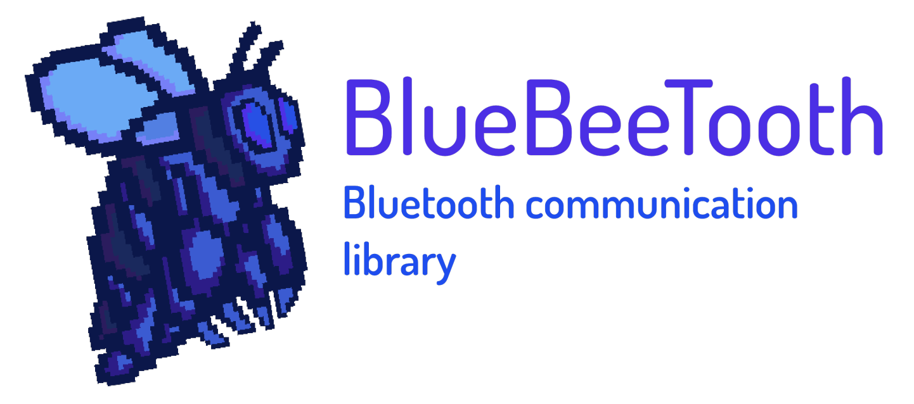

<h1 align="center">
    
</h1>

[]()

[](https://pypi.org/project/pandas/)


[](https://github.com/pandas-dev/pandas/blob/master/LICENSE)

A simple intercommunication between bluetooth devices and android smartphones library.

* Eliminates the need to implements basic bluetooth operations like reading and writing characteristics, connection with devices, etc...
* Allows a custom implementation of bluetooth listeners for custom or third party bluetooth devices (ie: MiBand 3)

# Requirements

This module requires the next libraries in the build.gradle (module level) of the app that will use it:

* [Reactivex.io](http://reactivex.io/)
* [Apache Commons Lang](http://commons.apache.org/proper/commons-lang/)

# Install proccess

The install proccess will be as follows:

* Download the actual release files (this will be an .arr file)
* In Android Studio go to **File** >> **Project Structure**
* Then click on the **+** icon, next selects **Import .JAR/.AAR Package**
* Finally in your **build.gradle (at module level)** add the line **implementation project(':bluebeetoothmodule-release')** to the dependencies

Now you are ready to begin bluetooth communication with your custom/third party devices :D!

# Usage

See the [example submodule](https://github.com/AlfonsoBarragan/BlueBeeTooth/tree/master/BlueBeeTooth/bluebeetoothmodule/src/main/java/es/esi/techlab/bluebeetoothmodule) that mades an implementation for communicating the MiBand3 with an android smartphone.

In your application, create a child class that ihnerits from BluetoothIO and implements the methdods for register listeners and remove listeners (because sometimes this requires special byte values that depends on what kind of device you are making the implementation).

The next step its to create the Profile and Protocol classes. This classes are used to:

* Profile; Contains the constant UUIDs for the service and characteristics of the device (ie: HeartRate measurement service).
* Protocol; Contains importan sequence of bytes that we need to perfom some operations with the devices (ie: pairing)

The final step its to create a class that ihnerits from BluetoothListener and follows the next scheme for every characteristic you need listen to.

## Create a PublishSubject as an attribute of the class

```java
public final class MiBand implements BluetoothListener {

    private PublishSubject<Boolean> setHeartRateMeasure;

}

```

## Initialize like this in the constructor of the class

```java
public final class MiBand implements BluetoothListener {

    private PublishSubject<Boolean> setHeartRateMeasure;

     public MiBand() {
        setHeartRateMeasure = PublishSubject.create();

    }

}
```

## Create an observable kind method like this

```java
public Observable<Boolean> measuringHeartRate() {
        return Observable.create(new ObservableOnSubscribe<Boolean>() {
            @Override
            public void subscribe(ObservableEmitter<Boolean> subscriber) throws Exception {
                setHeartRateMeasure.subscribe(new ObserverWrapper<>(subscriber));
                bluetoothIOMiBand.writeCharacteristic(Profile.UUID_SERVICE_HEARTRATE, Profile.UUID_CHAR_HEARTRATE, Protocol.COMMAND_SET_PERIODIC_HR_MEASUREMENT_INTERVAL);

            }
        });
    }
```

## Create a method to set a notify listener to the subject like this

```java
    public void setHeartRateMeasureNotifyListener(NotifyListener listener) throws InterruptedException {
        bluetoothIOMiBand.setNotifyListener(Profile.UUID_SERVICE_HEARTRATE, Profile.UUID_CHAR_HEARTRATE, listener);
    }
```